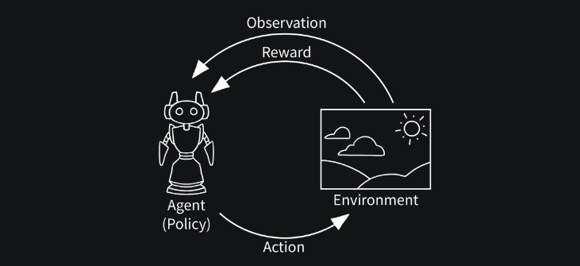

# Gymnasium 基本用法

## 前言

本文将深入介绍如何使用Gymnasium的基本功能，包括初始化环境、与环境互动、动作与观察空间，以及如何使用包装器修改环境。

## 介绍

>Gymnasium是一个为单一智能体强化学习环境提供API的项目，其中包括了常见环境的实现，如cartpole、pendulum、mountain-car、mujoco、atari等等。

Gymnasium的API包含四个关键函数：make、reset、step和render。本篇技术博客将介绍这些基本用法。Gymnasium的核心是Env，它是一个高级Python类，代表了强化学习理论中的马尔可夫决策过程（MDP）。在Gymnasium中，环境（MDP）以Env类的形式实现，同时还包括了Wrappers，它们提供了有用的工具，并可以改变传递给用户的结果。

## 实现流程

### 1.创建环境

在Gymnasium中，初始化一个强化学习环境非常简单，您可以使用`make`函数来创建一个特定的环境实例。例如，如果您想创建一个名为"CartPole-v1"的环境，可以执行以下代码：

```python
import gymnasium as gym
env = gym.make('CartPole-v1')
```

这将创建一个名为`env`的环境实例，您可以通过它与环境进行互动。Gymnasium支持众多预定义的环境，同时还允许用户自定义环境。

### 2.观察与动作空间

每个环境都定义了观察（observation）和动作（action）的空间。观察空间描述了代理程序能够接收的观察信息的类型和范围，而动作空间则定义了代理程序可以执行的操作。

我们可以使用以下代码来获取观察空间和动作空间的信息：

```python
observation_space = env.observation_space
action_space = env.action_space
```

观察空间通常是一个`Box`或`Discrete`空间，用于表示观察信息的类型和取值范围。动作空间可以是`Box`或`Discrete`，用于定义代理程序可以执行的操作。这些信息对于构建强化学习算法非常重要，因为它们决定了代理程序可以采取的行动和观察的特性。

### 3.与环境进行交互


如图：与强化学习环境进行互动通常涉及以下步骤：

1. **重置环境**：在与环境互动之前，首先需要将环境重置到初始状态，以获取初始观察。

```python
observation = env.reset()
```

2. **执行动作**：接下来，代理程序选择一个动作并将其应用于环境。这个动作可以来自代理程序的策略，也可以是随机选择的动作。

```python
action = env.action_space.sample()  # 代理程序选择动作的示例
```

3. **获取反馈**：执行动作后，环境将返回一个新的观察、奖励、终止标志等信息。

```python
observation, reward, terminated, truncated, info = env.step(action)
```

4. **环境终止检查**：在某些情况下，环境可能会终止，例如代理程序成功完成任务或达到最大时间步数。如果环境终止，通常需要重新初始化环境以进行下一轮互动。

```python
if terminated or truncated:
    observation = env.reset()
```

这个互动循环将不断重复，直到达到某种终止条件，如任务完成或时间步数耗尽。


### 4.使用包装器修改环境

Gymnasium提供了包装器（Wrappers）来修改现有的环境，而无需直接修改环境的底层代码。包装器可用于添加功能、修改环境的行为或观察，以及进行其他自定义修改。

使用包装器可以将一系列功能应用于环境，同时保持原始环境不受影响。以下是如何使用包装器的示例：

```python
from gymnasium.wrappers import FlattenObservation
env = gym.make("CarRacing-v2")
wrapped_env = FlattenObservation(env)
```

在这个示例中，我们使用了`FlattenObservation`包装器，它将环境的观察空间展平成一个一维向量。包装器可以堆叠在一起，以便组合它们的效果，从而实现复杂的环境修改。

### 5.Agent与环境互动

我们来看一个完整的示例，展示了一个代理程序如何与环境互动：

```python
import gymnasium as gym

# 创建环境
env = gym.make("LunarLander-v2", render_mode="human")
observation, info = env.reset()

# 与环境互动
for _ in range(1000):
    action = env.action_space.sample()  # 代理策略选择动作
    observation, reward, terminated, truncated, info = env.step(action) # 得到该动作反馈的环境状态

    if terminated or truncated:
        observation, info = env.reset()

# 关闭环境
env.close()
```

这个程序演示了一个代理程序如何与OpenAI Gym中的"LunarLander-v2"环境互动。该环境模拟了一个太空着陆任务，代理程序需要控制一个太空舱，使其成功着陆在指定的目标区域，同时最小化燃料消耗和减小速度。

在我们深入代码之前，让我们简要回顾一下强化学习的一些基本概念：

- **智能体（Agent）**：代理程序，它是我们希望训练的实体，负责在环境中执行动作。

- **环境（Environment）**：模拟代理程序将与之互动的环境，提供了观察和奖励。

- **观察（Observation）**：代理程序在每个时间步接收到的环境信息，用于了解当前环境状态。

- **动作（Action）**：代理程序在每个时间步执行的操作，目的是最大化累积奖励。

- **奖励（Reward）**：在每个时间步代理程序收到的反馈，表示代理程序的行为是好还是坏。

- **终止状态（Termination）**：环境是否结束，通常由任务完成或达到时间限制触发。

- **策略（Policy）**：代理程序的策略决定了在给定观察下应该采取哪个动作。


现在，让我们深入代码并逐步解释每个部分的功能。

#### 导入必要的库和创建环境

首先，我们导入了`gymnasium`库，它是OpenAI Gym的扩展版本。然后，我们使用`gym.make`函数创建了一个名为"LunarLander-v2"的环境，并将`render_mode`参数设置为"human"，以便在互动过程中可视化环境。

```python
import gymnasium as gym

# 创建环境
env = gym.make("LunarLander-v2", render_mode="human")
observation, info = env.reset()
```

#### 与环境互动

下一步，我们进入了与环境互动的主要循环。在这个循环中，代理程序将与环境交互，尝试学习如何在"LunarLander-v2"环境中着陆。

```python
for _ in range(1000):
    action = env.action_space.sample()  # 代理策略选择动作
    observation, reward, terminated, truncated, info = env.step(action)
```

在每个时间步，代理程序执行以下步骤：

- **选择动作**：我们使用`env.action_space.sample()`从动作空间中随机选择一个动作。这是一个随机策略，代理程序没有明智的决策方式，只是随机尝试不同的动作。

- **与环境交互**：代理程序通过调用`env.step(action)`来执行所选择的动作，并从环境中获取观察、奖励、终止标志等反馈信息。这个信息可以帮助代理程序了解它的行为和环境的状态。

#### 环境终止检查

在某些时间步，环境可能会终止，这意味着任务已完成或达到了最大时间步数。如果环境终止，我们需要调用`env.reset()`来重新初始化环境，以进行下一轮互动。

```python
if terminated or truncated:
    observation, info = env.reset()
```

#### 关闭环境

最后，在与环境的互动完成后，我们使用`env.close()`来关闭环境。

```python
# 关闭环境
env.close()
```

这个程序提供了一个入门级的示例，展示了代理程序如何在OpenAI Gym的"LunarLander-v2"环境中执行随机策略。请注意，这只是一个起点，通常代理程序会经过训练学习更智能的策略以实现更好的性能。深入了解强化学习算法和更复杂的策略是进一步研究的方向。

## 结语

在本文中，我们详细介绍了Gymnasium的基本用法，包括初始化环境、与环境互动、观察与动作空间，以及使用包装器来修改环境。这些基本功能是进行强化学习实验和开发强化学习算法的关键步骤。希望本文能够帮助您理解如何使用Gymnasium，并为学习者的强化学习项目提供良好的基础。
